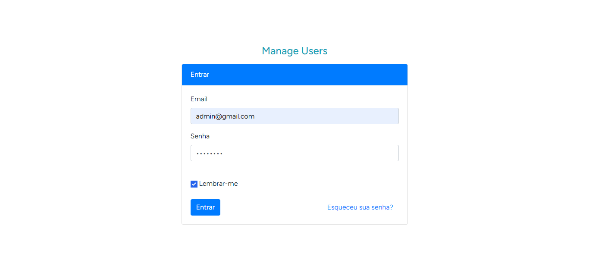
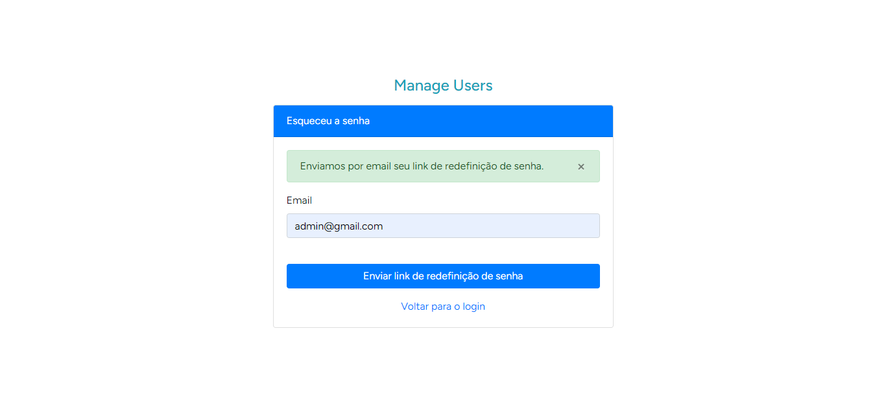
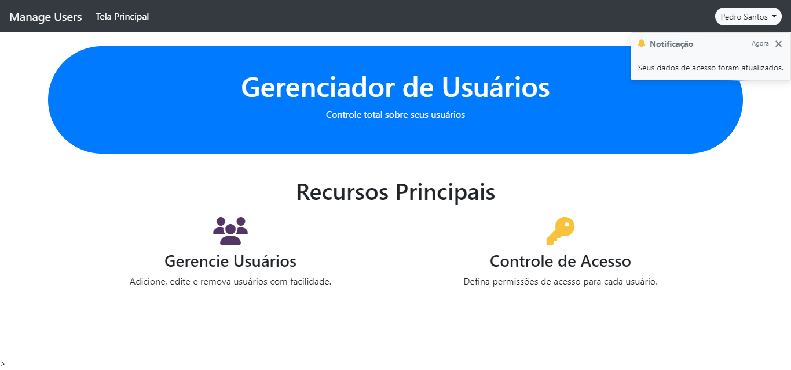
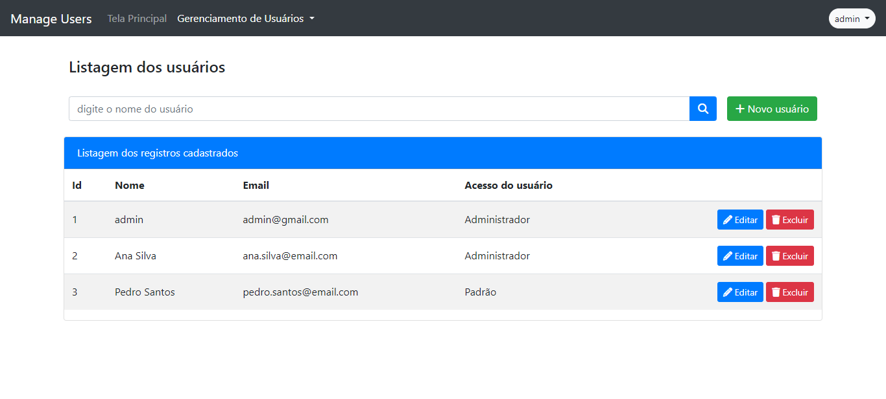

<h2 align="center">
	Manage Users ☑️
</h2>

<p align="center">
    <a href="#-sobre-o-projeto">Sobre</a> •
    <a href="#-firebase">Firebase</a> •
    <a href="#-layout">Layout</a> • 
    <a href="#-como-executar-o-projeto">Como executar</a> • 
    <a href="#-tecnologias">Tecnologias</a> •  
    <a href="#-autor">Autor</a>
</p>

## 💻 Sobre o projeto

O Manage Users é um sistema de gerenciamento de usuários que oferece funcionalidades para criação, edição e visualização de usuários com diferentes níveis de acesso. Os principais recursos incluem notificações por e-mail e notificações push em tempo real.

---

## 🔥 Firebase

O projeto utiliza o Firebase para recursos como notificações push em tempo real. A seguir estão os passos para configurar o Firebase em seu ambiente de desenvolvimento.

### ⏳ Pré-requisitos

Antes de começar, é necessário ter algumas informações e ferramentas em mãos:

- Conta do Google (para acessar o [Firebase Console](https://console.firebase.google.com/)).
- [Node.js](https://nodejs.org/) e [npm](https://www.npmjs.com/) instalados em sua máquina.

### ⚙️ Configuração do Firebase

Siga esses passos para configurar o Firebase no seu projeto:

1. **Acesse o Firebase Console:**
    - Vá para o [Firebase Console](https://console.firebase.google.com/).
   - Faça login com sua conta do Google.

2. **Crie um Projeto:**
   - Crie um novo projeto no Firebase Console e dê a ele um nome relevante para o seu aplicativo.

3. **Configure o Aplicativo da Web:**
   - No painel do projeto, clique na opção "Adicionar aplicativo da web".
   - Siga as instruções para configurar o aplicativo da web. Isso incluirá a geração de um arquivo de configuração que contém informações importantes, como a chave da Web.

4. **Obtenha o Arquivo JSON da Conta de Serviço:**
   - Você precisar acessar a seção "Configurações do projeto" no Firebase Console e baixar o arquivo JSON da Conta de Serviço.

5. **Armazene as Credenciais:**
   - Mantenha o arquivo JSON da Conta de Serviço e a chave da Web seguros e armazenados no diretório storage/app.

---

## 🎨 Layout

O layout foi desenvolvido com base no Bootstrap, proporcionando uma interface amigável e responsiva.
 
<p>
    <a href="https://getbootstrap.com/docs/4.6/getting-started/introduction/">
        
    </a>
</p> 

<p align="center" style="display: flex; align-items: flex-start; justify-content: center;">
    
</p>

<p align="center" style="display: flex; align-items: flex-start; justify-content: center;">
    
</p>

<p align="center" style="display: flex; align-items: flex-start; justify-content: center;">
    
</p>

<p align="center" style="display: flex; align-items: flex-start; justify-content: center;">
    
</p>

<h4 align="center"> 
    📂 Manage Users 📂
</h4>

---

## 📌 Como executar o projeto

#### ⏳ Pré-requisitos

Antes de começar, você vai precisar ter instalado em sua máquina as seguintes ferramentas:
[Git](https://git-scm.com), [Laragon](https://laragon.org/) com nginx, mysql e php 8. Além disto é bom ter um editor para trabalhar com o código como o [VSCode](https://code.visualstudio.com/)


#### 🧭 Baixando o projeto

```bash
# Clone este repositório
$ git clone git@github.com:danilalucas/manage-users.git
```
#### ⚙️ Configurando o projeto

```bash
# Acessar diretório
$ cd manage-users
# Instalar pacotes
$ composer install --dev
# Copiar env
$ cp .env.example .env
# No VSCode acessar .env e configurar conexão do banco
    DB_CONNECTION=mysql
    DB_HOST=127.0.0.1
    DB_PORT=3306
    DB_DATABASE=laravel
    DB_USERNAME=root
    DB_PASSWORD=
# No arquivo .env configure os dados de acesso do primeiro usuário admin
    ADMIN_NAME=
    ADMIN_EMAIL=
    ADMIN_PASSWORD=
# No arquivo .env configure as credenciais do firebase
    FIREBASE_DATABASE_URL=
    FIREBASE_CREDENTIALS=
# Execute as migrações do banco de dados
$ php artisan migrate
# Execute as seeders do banco de dados
$ php artisan db:seed
# Inicie o servidor Laravel Mix para compilação de recursos
$ npm run dev
# Se desejar que o Laravel continue a observar os arquivos e recompilar automaticamente quando houver alterações
$ npm run watch
# Após compilar os recursos, você pode acessar o projeto via navegador usando a url disponibilizada pelo laragon
```
---

## 🛠 Tecnologias

As seguintes ferramentas foram usadas na construção do projeto:

-   **[PHP](https://www.php.net/)**
-   **[Laravel](https://laravel.com/)**
-   **[Laravel Mix](https://laravel-mix.com/)**
-   **[Laravel Firebase](https://github.com/kreait/laravel-firebase)**
-   **[Laravel Notification Channels - fcm](https://github.com/laravel-notification-channels/fcm)**
-   **[Firebase](https://firebase.google.com/docs/cloud-messaging?hl=pt-br)**
-   **[Bootstrap](https://getbootstrap.com/)**
-   **[JavaScript Vanilla](https://developer.mozilla.org/pt-BR/docs/Web/JavaScript)**
-   **[Laragon](https://laragon.org/)**
-   **[MySQL](https://www.mysql.com/)**
-   **[Nginx](https://www.nginx.com/)**

---

## 👩🏻‍💻 Autor

<p>
    <a href="https://github.com/danilalucas">
        
        <br />
        <sub><b>Daníla Lucas</b></sub>
    </a>
</p>

[](https://www.linkedin.com/in/danila-lucas/)
[](mailto:danilatlucas@gmail.com)

Feito com ❤️ por Daníla Lucas 👋🏽 [Entre em contato!](https://www.linkedin.com/in/danila-lucas/)

---